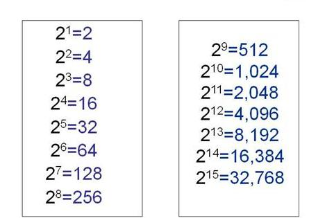

# grocaem-algorithms О книге и полезные ссылки.
читаем Грокаем. Алгоритмы Иллюстрированное пособие для программистов и любопытствующих.

Ресурс с алгоритмами сортировки (и не только) [link](https://www.khanacademy.org/)

Код примеров книги можно загрузить на сайте издательства
[link](https://github.com/egonSchiele/grokking_algorithms)

## Бинарный поиск.
Бинарный поиск - при каждом шаге исключается половина вариантов.
В общем случае для списка из n элементов бинарный поисквыполняется за log2N шагов, тогда
как простой поиск будет выполнен за n шагов.

Бинарный поиск - алгоритм который на вход получает отсортированнай список элементов, если искомый элемент в списке присутствует, возвращает позицию в списке этого элемента, если нет то возвращает null

Рассмотрим этот алгоритм в файле:
`binary_search.py`

Таблица степеней двойки показывает количество попыток которые нужно сделать для нахождения искомого числа в списке

Бинарный поиск работает только при условии отсортированного списка

## Время выполнения О (буква "О" большое)

Для оценки эффективности выполнения программы, или работы алгоритма придумали оптимизацию по времени или по памяти.
Подумаем сколько времени сэкономит нам бинарный поиск числа.

В первом варианте мы последовательно проверяем каждое число в списке с искомым числом, в худшем случае, придется пройти по всему списку (4 миллиарда чисел и нам "светит" 4 миллиарда попыток). Такое время называют "линейным". O(n)

Второй вариант бинарный поиск, и с ним дело обстоит иначе. Для списка из 4 милиардов элементов потребуется не более 32 попыток. Впечатляющая разница. Такое время выполнения называют "Логарифмическим" O(log n)

Когда упоменается "О - большое", log всегда означает, log2 (логорифм по основанию 2)
Пример: для списка из 8 чисел (а нам нужно найти загаданное число из этого списка) при бинарном поиске нам понадобится log 8 эот равно 3,
так как 2 в степени 3 будет равно 8. Так что понадобится проверить не более 3 чисел 
что бы узнать искомое число.

остановились (стр 28)

